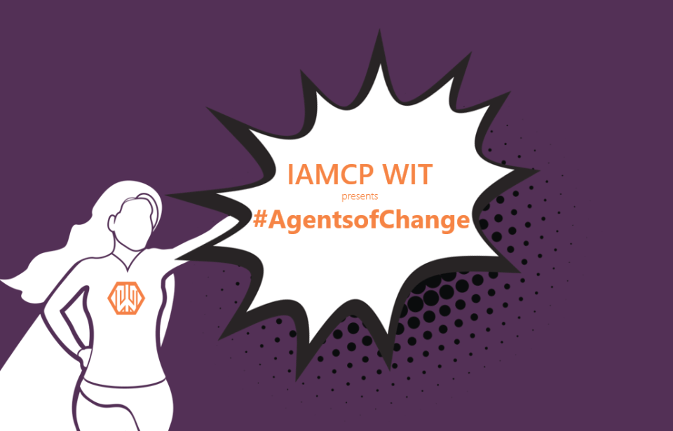

<!-- Main -->

<!-- Two -->
<section id="two" class="spotlights">
	<section>
		
		

			

				<header class="major">
					<h3>#AgentsOfChange</h3>
				</header>
				
Comment définir et devenir l'un des agents de changement pour modifier durablement le paysage professionnel et profiter d'un environnement divers ? Le WIT France nous a restituté les temps forts d'INSPIRE 2018 et nous a invité à devenir un agent de changement !!!

				<ul class="actions">
					<li><a href="Event-20180910.html" class="button">Learn more</a></li>
				</ul>
			

		

	</section>
	<!--<section>
		
		

			

				<header class="major">
					<h3>Rhoncus magna</h3>
				</header>
				
Nullam et orci eu lorem consequat tincidunt vivamus et sagittis magna sed nunc rhoncus condimentum sem. In efficitur ligula tate urna. Maecenas massa sed magna lacinia magna pellentesque lorem ipsum dolor. Nullam et orci eu lorem consequat tincidunt. Vivamus et sagittis tempus.

				<ul class="actions">
					<li><a href="element.html" class="button">Learn more</a></li>
				</ul>
			

		

	</section>
	<section>
		
		

			

				<header class="major">
					<h3>Sed nunc ligula</h3>
				</header>
				
Nullam et orci eu lorem consequat tincidunt vivamus et sagittis magna sed nunc rhoncus condimentum sem. In efficitur ligula tate urna. Maecenas massa sed magna lacinia magna pellentesque lorem ipsum dolor. Nullam et orci eu lorem consequat tincidunt. Vivamus et sagittis tempus.

				<ul class="actions">
					<li><a href="generic.html" class="button">Learn more</a></li>
				</ul>
			

		

	</section>-->
</section>

<!-- Three 
<section id="three">
	

		<header class="major">
			<h2>Massa libero</h2>
		</header>
		
Nullam et orci eu lorem consequat tincidunt vivamus et sagittis libero. Mauris aliquet magna magna sed nunc rhoncus pharetra. Pellentesque condimentum sem. In efficitur ligula tate urna. Maecenas laoreet massa vel lacinia pellentesque lorem ipsum dolor. Nullam et orci eu lorem consequat tincidunt. Vivamus et sagittis libero. Mauris aliquet magna magna sed nunc rhoncus amet pharetra et feugiat tempus.

		<ul class="actions">
			<li><a href="generic.html" class="button next">Get Started</a></li>
		</ul>
	

</section>-->
